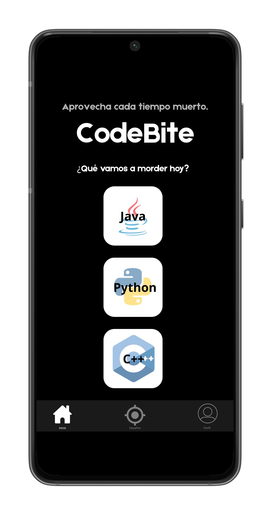
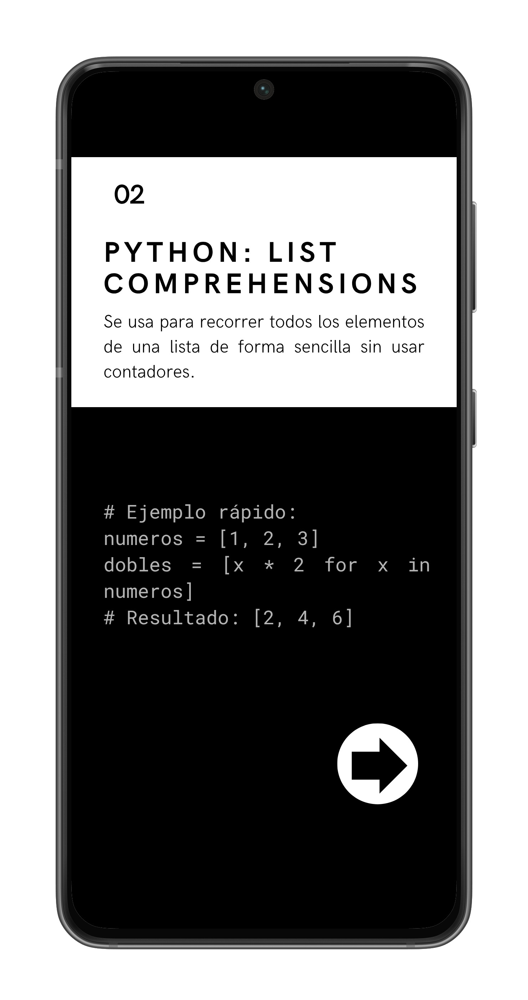
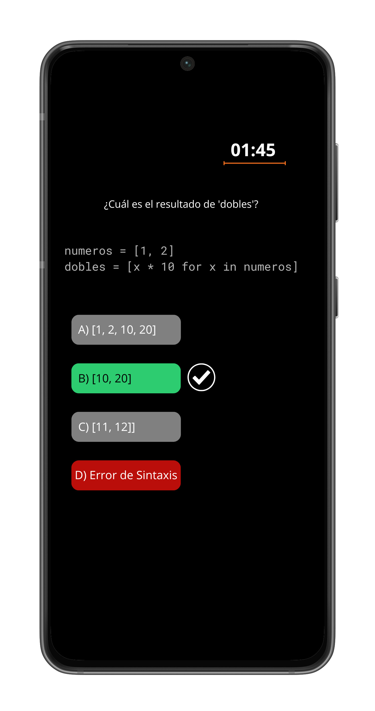
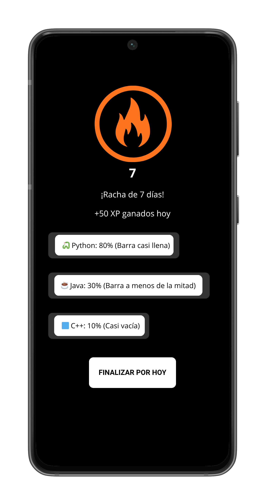

# Diseño de interfaz de usuario

La aplicación tendrá la siguientes pantallas

1. Pantalla 1:

2. Pantalla 2:

3. Pantalla 3:

4. Pantalla 4:

# Referencias

- [Material Design: Foundations](https://m3.material.io/foundations)
- [Material Design: Style](https://m3.material.io/styles)
